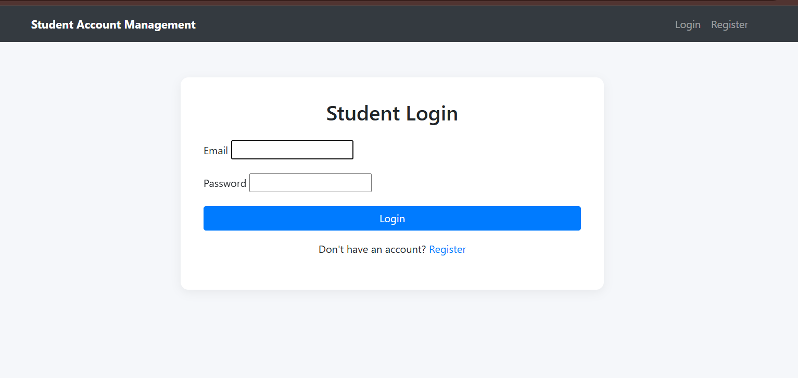
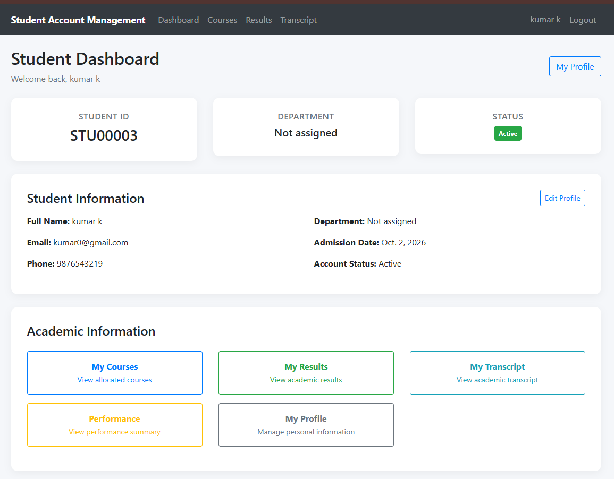
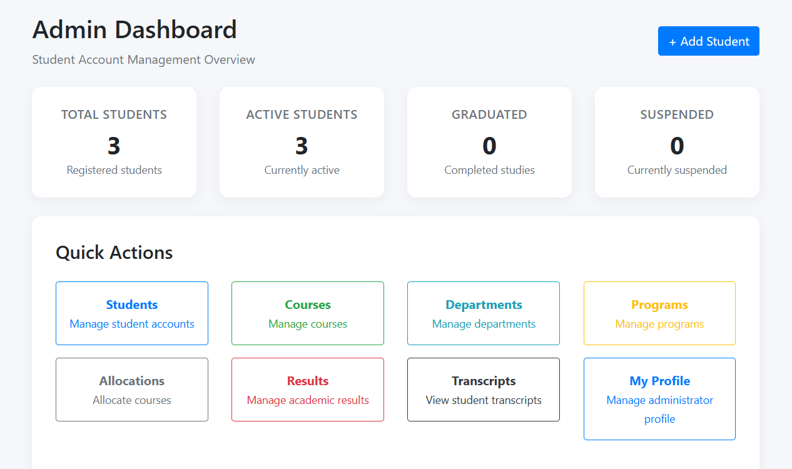
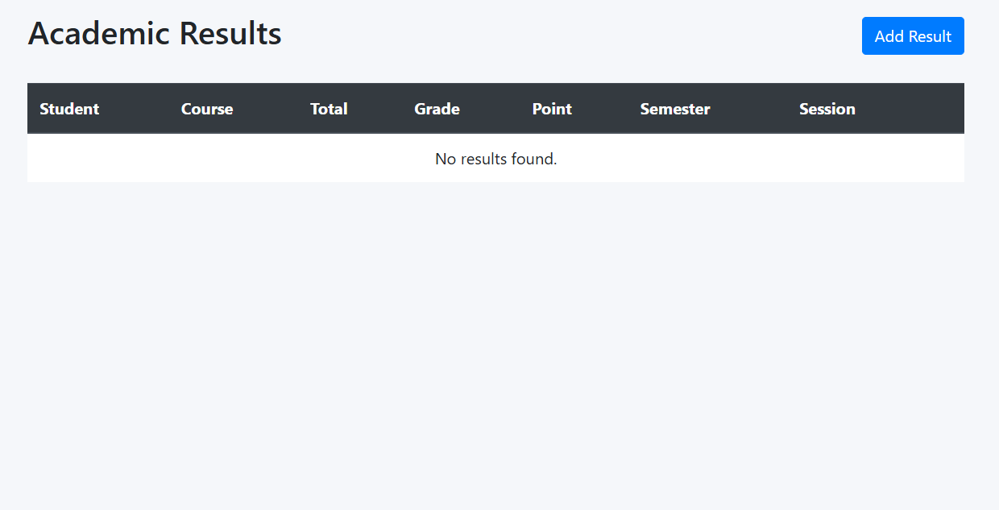

# Student Account Management System

A Django-based web application for managing student accounts and academic information through role-aware dashboards, course management, course registration, results processing, and transcript generation.

## Overview

The project provides a centralized academic portal for students and staff. Students can create and manage their accounts, view academic information, register for courses, and review their results. Staff users can manage student records, courses, academic programs, and result data.

## Key Features

### Authentication & Student Accounts
- Email-based authentication with a custom Django user model
- Student self-registration
- Automatic student ID generation
- Student profile viewing and editing
- Student lifecycle statuses: Active, Suspended, Graduated, Withdrawn
- Staff-only student management and search

### Academic Structure
- Department management
- Program management
- Course catalog
- Semester and credit information
- Elective course support
- Course allocation / registration by academic session

### Results & Academic Performance
- Staff result entry
- Assignment and examination score handling
- Automatic total-score calculation
- Automatic grade and grade-point calculation
- Credit-weighted CGPA calculation
- Academic transcript view

### Dashboards
- Staff dashboard with student statistics
- Student dashboard with account and academic navigation
- Responsive Bootstrap-based interface with custom styling

## Screenshots

### Login



### Student Dashboard



### Staff Dashboard



### Academic Results



## Technology Stack

- **Backend:** Python, Django
- **Database:** SQLite (default local development database)
- **Frontend:** HTML5, CSS3, JavaScript, Bootstrap 4
- **ORM:** Django ORM
- **Forms:** Django Forms, django-crispy-forms
- **Media:** Pillow

## Architecture

The application is organized into focused Django apps:

```text
Browser
   │
   ▼
Django URL routing
   │
   ├── accounts  ──► authentication, profiles, student management
   ├── course    ──► departments, programs, courses, registration
   ├── result    ──► marks, grades, CGPA, transcript
   └── core      ──► home and dashboards
             │
             ▼
        Django ORM
             │
             ▼
          SQLite
```

## Project Structure

```text
student-account-management-system/
│
├── manage.py
├── requirements.txt
├── README.md
├── .gitignore
│
├── config/
│   ├── settings.py
│   ├── urls.py
│   ├── asgi.py
│   └── wsgi.py
│
├── apps/
│   ├── accounts/
│   ├── core/
│   ├── course/
│   └── result/
│
├── templates/
│   ├── accounts/
│   ├── core/
│   ├── course/
│   └── result/
│
├── static/
│   ├── css/
│   └── js/
│
└── screenshots/
    ├── 01-login.png
    ├── 02-student-dashboard.png
    ├── 03-admin-dashboard.png
    └── 04-results.png
```

## Local Setup

### 1. Clone the repository

```bash
git clone https://github.com/<your-username>/student-account-management-system.git
cd student-account-management-system
```

### 2. Create a virtual environment

```bash
python -m venv venv
```

Activate it before continuing.

**Windows:**

```bash
venv\Scripts\activate
```

**macOS/Linux:**

```bash
source venv/bin/activate
```

### 3. Install dependencies

```bash
pip install -r requirements.txt
```

### 4. Create the local database

```bash
python manage.py migrate
```

### 5. Create a staff/admin account

```bash
python manage.py createsuperuser
```

Follow the prompts to create the development account.

### 6. Start the development server

```bash
python manage.py runserver
```

Then open the local address shown by Django in your browser.

## Configuration & Security

The repository is prepared as a development/portfolio project. Before production deployment:

- Replace the development `SECRET_KEY` with a secure environment variable.
- Set `DEBUG = False`.
- Restrict `ALLOWED_HOSTS` to the intended domains.
- Keep production credentials and secrets outside source control.
- Use a production-grade database and deployment configuration.

The local SQLite database is intentionally not part of the public source package; a fresh database can be created with the migration commands above.

## Learning / Engineering Highlights

This project demonstrates practical use of:

- Custom Django authentication and user models
- Role-aware access control
- Relational data modelling with Django ORM
- Form validation and transactional student creation
- CRUD-style student and academic management workflows
- Automatic grading and credit-weighted CGPA calculation
- Template-based server-side rendering
- Separation of concerns across Django applications

## Portfolio Note

This repository is maintained as a portfolio version of the Student Account Management System. The source should remain consistent with the screenshots and documentation, and only features that are actually implemented should be described here.

## License

No open-source license is applied by default. See the repository owner’s licensing decision before reuse, redistribution, or derivative publication.
